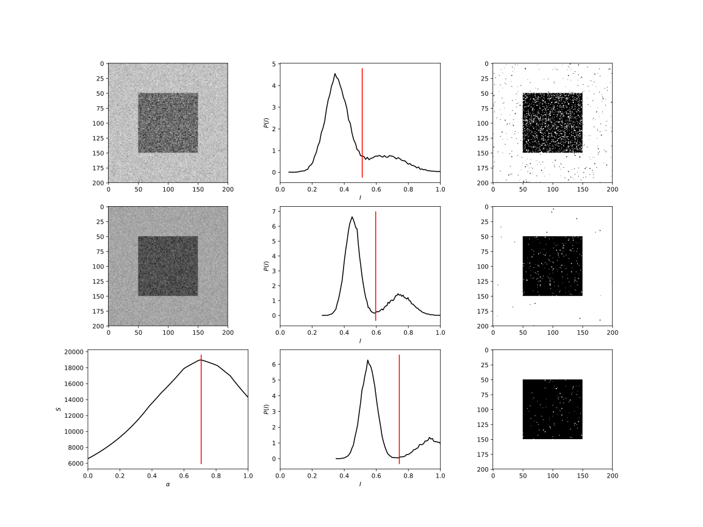

*************************
Image manipulation tricks
*************************

Segmentation
============

Ostu's method
-------------

.. note:: **References**

  *   `Implement Otsu's thresholding in Python without using OpenCV and MATLAB <https://www.quora.com/How-do-I-implement-Otsus-thresholding-in-Python-without-using-OpenCV-and-MATLAB-1>`_
  *   `Scikit's skimage.filters.threshold_otsu <https://github.com/scikit-image/scikit-image/blob/master/skimage/filters/thresholding.py#L230>`_
  *   `Scikit's Otsu's thresholding <https://scipy-lectures.org/packages/scikit-image/auto_examples/plot_threshold.html>`_

[:download:`source: otsu.py <otsu.py>`]

.. literalinclude:: otsu.py
   :language: python
