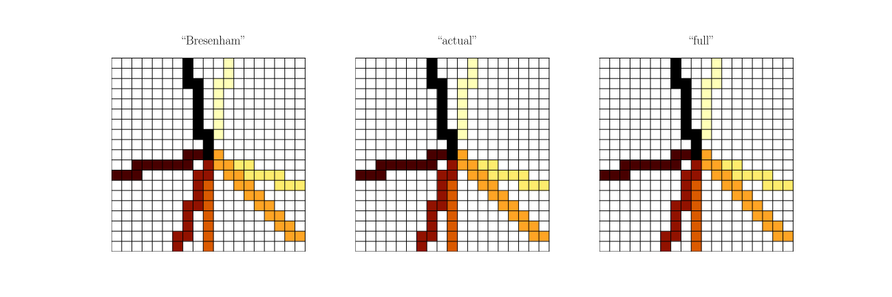
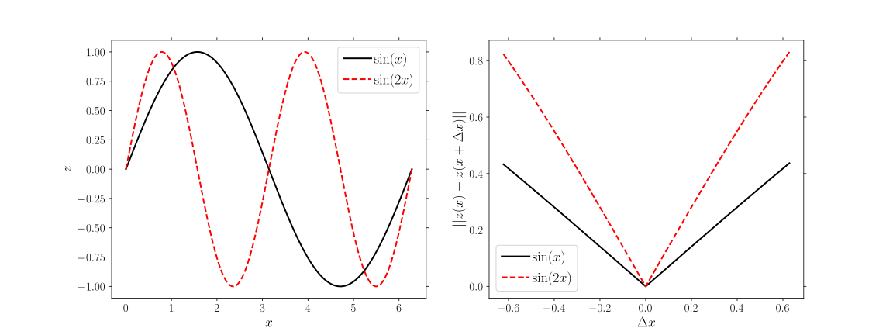
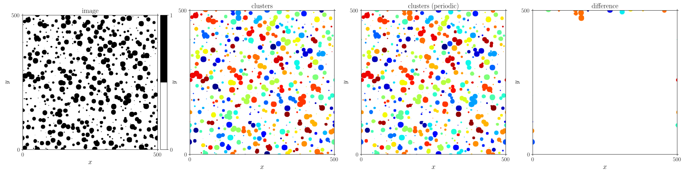
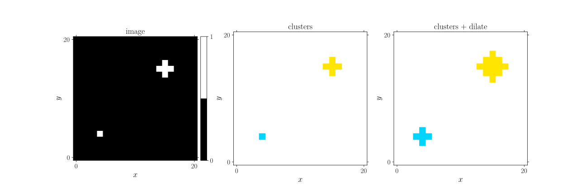

*****************
Theory & Examples
*****************

.. _theory_S2:

2-point probability / auto-correlation
======================================

.. todo::

  Split 2-point probability and auto-correlation, to not mix introducing ensemble averages and masked correlation. Also, try to work more with differences.

Theory
------

This measure determines the typical distance over which two points (pixels, voxels, ...) are related to each other. This is best understood by considering a binary 2D image, wherein each pixel is either black or white. This is described by the following indicator function, indicating the 'greyscale' of a pixel at position :math:`\vec{x}_i`:

.. math::

  \mathcal{I}(\vec{x}_i)
  =
  \begin{cases}
    1 \quad & \mathrm{if}\;\; \vec{x}_i\; \in \mathrm{white} \\
    0 \quad & \mathrm{if}\;\; \vec{x}_i\; \in \mathrm{black} \\
  \end{cases}

The 2-point probability, :math:`S_2`, is the probability that two points, at a certain distance :math:`\Delta \vec{x}` are both white. I.e.

.. math::

  S_2 (\Delta \vec{x})
  =
  P
  \big\{
    \mathcal{I}( \vec{x}               ) = 1 ,
    \mathcal{I}( \vec{x}+\Delta\vec{x} ) = 1
  \big\}

Two limits can directly be identified. If the two points coincide, the probability that both points are white is the same as the probability that one point is white: the (volume) fraction of white, :math:`\varphi`. I.e.

.. math::

  S_2 ( || \Delta \vec{x} || = 0) = \varphi

If the two points are completely uncorrelated, when the points are far apart, each point has a probability :math:`\varphi` to be white, and thus

.. math::

  S_2 ( || \Delta \vec{x} || \rightarrow \infty) = \varphi^2

In between these extremes, :math:`S_2` decays from :math:`\varphi` towards the asymptotic value of :math:`\varphi^2`.

The greyscale generalisation is the auto-correlation corresponds to a local product:

.. math::

  S_2 ( \Delta \vec{x} )
  =
  \frac{1}{N} \sum\limits_{i=1}^N \mathcal{I} ( \vec{x}_i ) \,
  \mathcal{I} ( \vec{x}_i + \Delta \vec{x} )
  \equiv \mathcal{I} ( \vec{x} ) \star \mathcal{I} ( \vec{x} )

Along the same arguments, limit values can be obtained. In this case:

.. math::

  S_2( \Delta \vec{x} = 0 )                &= \langle \mathcal{I}^2 \rangle   \\
  S_2( \Delta \vec{x} \rightarrow \infty ) &= \langle \mathcal{I}   \rangle^2

where the brackets :math:`\langle \ldots \rangle` denotes the spatial average.

Further reading
---------------

Textbooks
^^^^^^^^^

* Torquato, S. (2002). Random Heterogeneous Materials (1st ed.). Springer, New York, NY. New York. `doi:10.1007/978-1-4757-6355-3 <http://doi.org/10.1007/978-1-4757-6355-3>`_

Example
-------

This result is based on a simple, periodic, image comprising circular white inclusions embedded in a black background. The top row shows the image and the results for the binary image: from left to right: the image, the 2-point probability :math:`S_2` in two dimensions, and a cross-section of this result in the middle of the region-of-interest along the horizontal axis. The same image and results are shown on the bottom row for a greyscale image, for which noise is added and the background and the islands are made grey.

.. image:: examples/S2.svg
  :width: 700px

This example is based on the following code.

.. note::

    The Python-code can used for the plotting: The complete code is included in the download. Note that to obtain the same plot one should download and install the matplotlib-styles available in `GooseMPL <https://www.github.com/tdegeus/GooseMPL>`_.

Python
^^^^^^

:download:`S2.py <examples/S2.py>`

.. literalinclude:: examples/S2.py
   :language: python
   :start-after: <snippet>
   :end-before: </snippet>

C++
^^^

:download:`S2.cpp <examples/S2.cpp>`

.. literalinclude:: examples/S2.cpp
   :language: cpp

.. _theory_S2_masked:

Masked correlation
------------------

This function also has the possibility to mask certain pixels. The image's mask is a binary matrix of exactly the same shape as the image. For each pixel in the mask with value ``1``, the corresponding pixel in the image is ignored. The normalisation is corrected for the reduced amount of data points, whereby the number of data points is no longer constant over the region-of-interest.

.. image:: examples/S2_mask.svg
  :width: 700px

Python
^^^^^^

:download:`S2_mask.py <examples/S2_mask.py>`

.. literalinclude:: examples/S2_mask.py
   :language: python
   :start-after: <snippet>
   :end-before: </snippet>

C++
^^^

:download:`S2_mask.cpp <examples/S2_mask.cpp>`

.. literalinclude:: examples/S2_mask.cpp
   :language: cpp

.. _theory_S2_ensemble:

Ensemble average
----------------

.. todo::

  Description.

Python
^^^^^^

.. todo::

  Create.

C++
^^^

.. todo::

  Create.

.. _theory_C2:

2-point cluster function
========================

Theory
------

If an image consists of isolated clusters, the 2-point cluster function can be used to quantify the probability that two points are in the same cluster. It is defined as follows:

.. math::

  C_2 (\Delta x) =
  P \big\{ \mathcal{C}(\vec{x}) = \mathcal{C}(\vec{x}+\Delta\vec{x}) \neq 0 \big\}

whereby :math:`\mathcal{C}` is an indicator with a unique non-zero index for each cluster.

Further reading
---------------

Textbooks
^^^^^^^^^

* Torquato, S. (2002). Random Heterogeneous Materials (1st ed.). Springer, New York, NY. New York. `doi:10.1007/978-1-4757-6355-3 <http://doi.org/10.1007/978-1-4757-6355-3>`_

Example
-------

.. image:: examples/C2.svg
  :width: 700px

.. note::

  Like for the :ref:`2-point correlation <theory_S2>`, a :ref:`mask <theory_S2_masked>` can be used. Similarly, the average can be extended to that of an :ref:`ensemble <theory_S2_ensemble>` of images.

Python
^^^^^^

:download:`C2.py <examples/C2.py>`

.. literalinclude:: examples/C2.py
   :language: python
   :start-after: <snippet>
   :end-before: </snippet>

C++
^^^

:download:`C2.cpp <examples/C2.cpp>`

.. literalinclude:: examples/C2.cpp
   :language: cpp

.. _theory_L:

Lineal path function
====================

Theory
------

The 2-point cluster function has a first order notion of connectedness. To quantify the true connectedness along a path, the lineal path function is used. The lineal path function quantifies the probability that an entire path of pixels connecting :math:`\vec{x}_i` and :math:`\vec{x}_i + \Delta x` is in the same phase:

.. math::

  L ( \Delta x ) = P
  \big\{
    \mathcal{I}( \vec{x}                 ) = 1 ,
    \mathcal{I}( \vec{x}+\delta\vec{x}_1 ) = 1 ,
    \ldots
    \mathcal{I}( \vec{x}+\Delta\vec{x}   ) = 1
  \big\}

In practice the probability is constructed by starting from each pixel :math:`\vec{x}_i` for which :math:`\mathcal{I} ( \vec{x}_i )=1` 'walking' along a pixel path until the edge of the inclusion is reached at :math:`\vec{x}_i + \delta x_j`. The value of :math:`L` is increased for all the relative positions that have been passed along the path connecting :math:`\vec{0}` and :math:`\delta \vec{x}_j`. This is then repeated for all possible directions (with each their own path).

Two limit values can again be identified. At zero distance, the volume fraction is again found:

.. math::

  L ( \Delta \vec{x} = \vec{0} ) = \varphi

Furthermore it is highly unlikely that a path can be found through the inclusion phase to a relative position very far away. I.e.

.. math::

  L ( \Delta \vec{x} \rightarrow \infty ) = 0

An important ingredient of the computation of :math:`L` is thus the choice of the pixel paths. In GooseEYE the paths are constructed between the centre of the region of interest and each of the points on the end of the region of interest. The paths can be computed using different algorithms, illustrated below:

:download:`pixel_path.py <examples/pixel_path.py>`

Example
-------

.. image:: examples/L.svg
  :width: 700px

.. note::

  Like for the :ref:`2-point correlation <theory_S2>`, a :ref:`mask <theory_S2_masked>` can be used. Similarly, the average can be extended to that of an :ref:`ensemble <theory_S2_ensemble>` of images.

  .. todo::

    Check statement on mask.

Python
^^^^^^

.. todo::

  Check after xtensor conversion is done.

:download:`L.py <examples/L.py>`

.. literalinclude:: examples/L.py
   :language: python
   :start-after: <snippet>
   :end-before: </snippet>

C++
^^^

.. todo::

  Create after xtensor conversion is done.

.. _theory_W2:

Weighted correlation
====================

Theory
------

The weighted correlation characterised the average indicator :math:`\mathcal{I}` around high weight factor :math:`\mathcal{W}`.

Mathematically the weighted correlation reads

.. math::

  \mathcal{P} ( \Delta \vec{x} ) = \frac{
    \sum_i
    \mathcal{W}( \vec{x}_i ) \;
    \mathcal{I}( \vec{x}_i + \Delta x )
  }{
    \sum_i
    \mathcal{W}( \vec{x}_i ) \;
  }

Additionally pixels can be masked, for instance to ignore :math:`\mathcal{I}` everywhere where :math:`\mathcal{W}` is non-zero. The masked correlation reads

.. math::

  \mathcal{P} (\Delta \vec{x}) =
  \frac{
    \sum_{i}\;
    \mathcal{W} (\vec{x}_i) \;
    [ \mathcal{I} (1-\mathcal{M}) ] (\vec{x}_i + \Delta \vec{x}) \;
  }{
    \sum_{i}\;
    \mathcal{W} (\vec{x}_i) \;
    (1-\mathcal{M})\, (\vec{x}_i + \Delta \vec{x}) \;
  }

where all pixels where :math:`\mathcal{M}(\vec{x}_i) = 1` are ignored; all pixels for which :math:`\mathcal{M}(\vec{x}_i) = 0` are considered as normal.

Example
-------

.. image:: examples/W2.svg
  :width: 700px

.. note::

  Like for the :ref:`2-point correlation <theory_S2>`, a :ref:`mask <theory_S2_masked>` can be used. Similarly, the average can be extended to that of an :ref:`ensemble <theory_S2_ensemble>` of images.

Python
^^^^^^

:download:`W2.py <examples/W2.py>`

.. literalinclude:: examples/W2.py
   :language: python
   :start-after: <snippet>
   :end-before: </snippet>

C++
^^^

.. todo::

  Create.

Collapse to single point
------------------------

To calculate the probability of the inclusion directly next to a weight site (i.e. the red circles in the example above and below) the 'collapsed correlation' is calculated. The distance to the edge of the site, :math:`\vec{\delta}_i` is therefore corrected for as follows:

.. math::

  \mathcal{P} (\Delta \vec{x}) =
  \frac{
    \sum_{i}\;
    \mathcal{W} (\vec{x}_i) \;
    \mathcal{I} (\vec{x}_i + \Delta \vec{x} + \vec{\delta}_i) \;
  }{
    \sum_{i}\;
    \mathcal{W} (\vec{x}_i) \;
  }

Similarly to the above, a mask may be introduced as follows:

.. math::

  \mathcal{P} (\Delta \vec{x}) =
  \frac{
    \sum_{i}\;
    \mathcal{W} (\vec{x}_i) \;
    [ \mathcal{I} (1-\mathcal{M}) ] (\vec{x}_i + \Delta \vec{x} + \vec{\delta}_i) \;
  }{
    \sum_{i}\;
    \mathcal{W} (\vec{x}_i) \;
    (1-\mathcal{M})\, (\vec{x}_i + \Delta \vec{x} + \vec{\delta}_i) \;
  }

Example
^^^^^^^

.. image:: examples/W2c.svg
  :width: 700px

.. note::

  Like for the :ref:`2-point correlation <theory_S2>`, a :ref:`mask <theory_S2_masked>` can be used. Similarly, the average can be extended to that of an :ref:`ensemble <theory_S2_ensemble>` of images.

  .. todo::

    Check statement on mask.

Python
^^^^^^

.. todo::

  Check after xtensor conversion is done.

:download:`W2c.py <examples/W2c.py>`

.. literalinclude:: examples/W2c.py
   :language: python
   :start-after: <snippet>
   :end-before: </snippet>

C++
^^^

.. todo::

  Create after xtensor conversion is done.

.. _theory_heightheight:

Height-height correlation
=========================

The height-height correlation corresponds to the following:

.. math::

  \mathcal{P} (\Delta \vec{x}) =
  \sqrt{ \sum_{i} \; \left(
    z (\vec{x}_i + \Delta \vec{x}) -
    z (\vec{x}_i)
  \right)^2 }

Example
-------

.. note::

  Like for the :ref:`2-point correlation <theory_S2>`, a :ref:`mask <theory_S2_masked>` can be used. Similarly, the average can be extended to that of an :ref:`ensemble <theory_S2_ensemble>` of images.

Python
^^^^^^

:download:`heightheight.py <examples/heightheight.py>`

.. literalinclude:: examples/heightheight.py
   :language: python
   :start-after: <snippet>
   :end-before: </snippet>

C++
^^^

:download:`heightheight.cpp <examples/heightheight.cpp>`

.. literalinclude:: examples/heightheight.cpp
   :language: cpp

Obtain clusters
===============

Calculate clusters
------------------

Python
^^^^^^

.. todo::

  Check after xtensor conversion is done.

:download:`clusters.py <examples/clusters.py>`

.. literalinclude:: examples/clusters.py
   :language: python
   :start-after: <snippet>
   :end-before: </snippet>

C++
^^^

.. todo::

  Create after xtensor conversion is done.

Dilate clusters (differently)
-----------------------------

Python
^^^^^^

.. todo::

  Check after xtensor conversion is done.

:download:`clusters_dilate.py <examples/clusters_dilate.py>`

.. literalinclude:: examples/clusters_dilate.py
   :language: python
   :start-after: <snippet>
   :end-before: </snippet>

C++
^^^

.. todo::

  Create after xtensor conversion is done.
