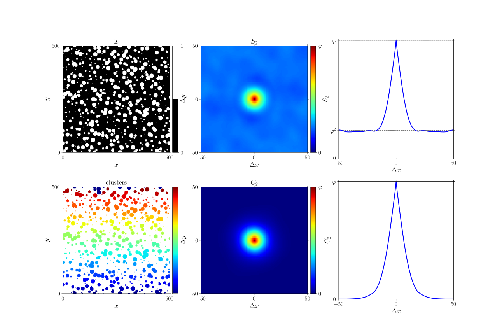

.. _theory_C2:

2-point cluster function
========================

Theory
------

If an image consists of isolated clusters ('islands' of connected pixels with the same value), the 2-point cluster function can be used to quantify the probability that two points are in the same cluster. It is defined as follows:

.. math::

  C_2 (\Delta x) =
  P \big\{ \mathcal{C}(\vec{x}) = \mathcal{C}(\vec{x}+\Delta\vec{x}) \neq 0 \big\}

whereby :math:`\mathcal{C}` is an indicator with a unique non-zero index for each cluster.

.. seealso::

  S. Torquato (2002). Random Heterogeneous Materials (1st ed.). Springer, New York, USA. `doi:10.1007/978-1-4757-6355-3 <http://doi.org/10.1007/978-1-4757-6355-3>`_

Example
-------

| :download:`C2.py <examples/C2.py>`
| :download:`C2.cpp <examples/C2.cpp>`

.. note::

  Like for the :ref:`2-point correlation <theory_S2>`, a :ref:`mask <theory_S2_masked>` can be used. Similarly, the average can be extended to that of an :ref:`ensemble <theory_S2_ensemble>` of images.

Python
^^^^^^

.. literalinclude:: examples/C2.py
   :language: python
   :start-after: <snippet>
   :end-before: </snippet>

C++
^^^

.. literalinclude:: examples/C2.cpp
   :language: cpp
