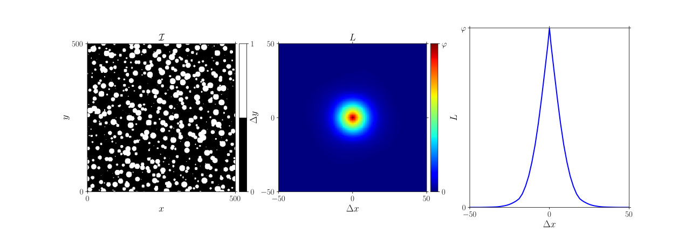

.. _theory_L:

Lineal path function
====================

Theory
------

The 2-point cluster function has a first order notion of connectedness.
To quantify the true connectedness along a path, the lineal path function is used.
The lineal path function quantifies the probability that an entire path of pixels connecting
:math:`\vec{x}_i` and :math:`\vec{x}_i + \Delta x`
(denoted: :math:`\{
\vec{x}_i + \delta\vec{x}_0,
\vec{x}_i + \delta\vec{x}_1, ... ,
\vec{x}_i + \delta\vec{x}_n \}`,
where :math:`\delta\vec{x}_0 \equiv \vec{0}` and
:math:`\delta\vec{x}_n \equiv \Delta\vec{x}`) is in the same phase:

.. math::

    L ( \Delta x ) = P
    \big\{
        \mathcal{I}(\vec{x}) = 1 ,
        \mathcal{I}(\vec{x}+\delta\vec{x}_1) = 1 ,
        \ldots
        \mathcal{I}(\vec{x}+\Delta\vec{x}) = 1
    \big\}

In practice the probability is constructed by starting from each pixel :math:`\vec{x}_i`
for which :math:`\mathcal{I} ( \vec{x}_i )=1` 'walking' along a pixel path
until the edge of the inclusion is reached at :math:`\vec{x}_i + \delta x_j`.
The value of :math:`L` is increased for all the relative positions that have been passed
along the path connecting :math:`\vec{0}` and :math:`\delta \vec{x}_j`.
This is then repeated for all possible directions (with each their own path).

Two limit values can again be identified. At zero distance, the volume fraction is again found:

.. math::

    L (\Delta \vec{x} = \vec{0}) = \varphi

Furthermore it is highly unlikely that a path can be found through the inclusion phase
to a relative position very far away. I.e.

.. math::

    L (\Delta \vec{x} \rightarrow \infty) = 0

An important ingredient of the computation of :math:`L` is thus the choice of the pixel paths.
In GooseEYE the paths are constructed between the centre of the region of interest and each
of the points on the end of the region of interest.
The paths can be computed using different algorithms, illustrated below:

:download:`pixel_path.py <examples/pixel_path.py>`

.. image:: examples/pixel_path.svg
    :width: 700px

Example
-------

| :download:`L.py <examples/L.py>`
| :download:`L.cpp <examples/L.cpp>`

.. note::

    Like for the :ref:`2-point correlation <theory_S2>`,
    the average can be extended to that of an
    :ref:`ensemble <theory_S2_ensemble>` of images.

Python
^^^^^^

.. literalinclude:: examples/L.py
    :language: python
    :start-after: <snippet>
    :end-before: </snippet>

C++
^^^

.. literalinclude:: examples/L.cpp
    :language: cpp
