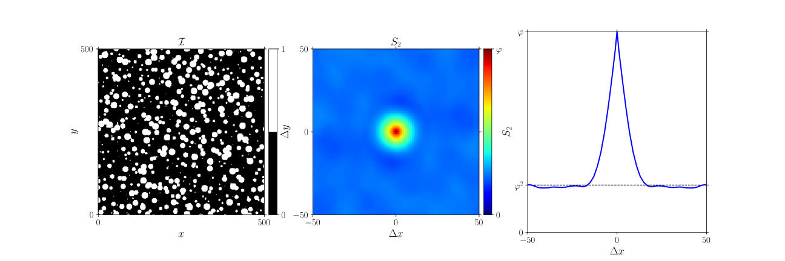
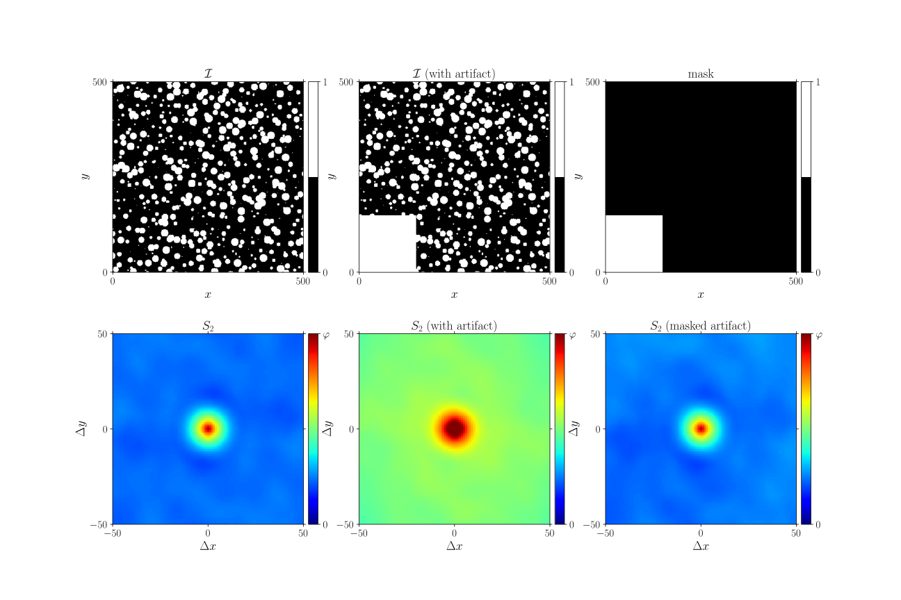
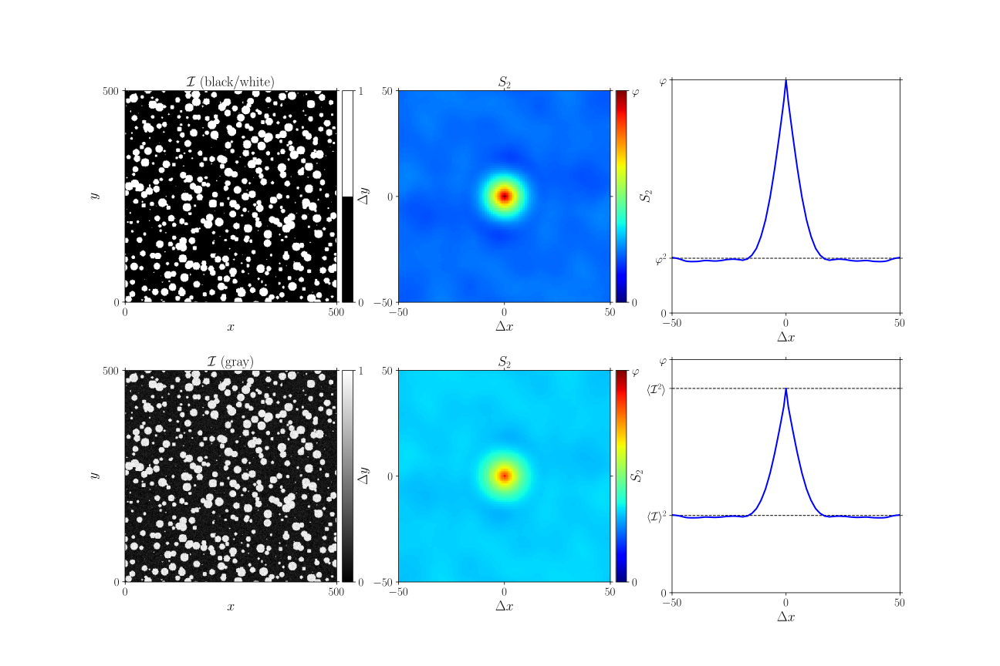

.. _theory_S2:

2-point probability
===================

Theory
------

This measure determines the typical distance over which two points (pixels, voxels, ...) are related to each other. This is best understood by considering a binary 2D image, wherein each pixel is either black or white. This is described by the following indicator function, indicating the 'greyscale' of a pixel at position :math:`\vec{x}_i`:

.. math::

    \mathcal{I}(\vec{x}_i)
    =
    \begin{cases}
        1 \quad & \mathrm{if}\;\; \vec{x}_i\; \in \mathrm{white} \\
        0 \quad & \mathrm{if}\;\; \vec{x}_i\; \in \mathrm{black} \\
    \end{cases}

The 2-point probability, :math:`S_2`, is the probability that two points, at a certain distance :math:`\Delta \vec{x}` are both white. I.e.

.. math::

    S_2 (\Delta \vec{x})
    =
    P
    \big\{
        \mathcal{I}(\vec{x}) = 1 ,
        \mathcal{I}(\vec{x} + \Delta\vec{x}) = 1
    \big\}

Two limits can directly be identified.
If :math:`\Delta\vec{x} = \vec{0}`,
:math:`S_2` is simply the probability that a point is white:
the (volume) fraction of white, :math:`\varphi`.
I.e.

.. math::

    S_2 ( || \Delta \vec{x} || = 0) = \varphi

The two points are completely uncorrelated if :math:`|| \Delta\vec{x} ||`
is sufficiently large (i.e. larger than the correlation length).
In this case, both a point at :math:`\vec{x}` and at
:math:`\vec{x} + \Delta \vec{x}` have a probability
:math:`\varphi` to be white, and thus

.. math::

    S_2 ( || \Delta \vec{x} || \rightarrow \infty) = \varphi^2

In between these extremes, :math:`S_2` decays from :math:`\varphi`
towards the asymptotic value of :math:`\varphi^2`.

.. seealso::

    S.\ Torquato (2002).
    Random Heterogeneous Materials (1st ed.). Springer, New York, USA. `
    doi:10.1007/978-1-4757-6355-3 <http://doi.org/10.1007/978-1-4757-6355-3>`_.

Example
-------

This example is based on a simple, periodic,
image comprising circular white inclusions embedded in a black background.
The figure shows from left to right: the image,
the 2-point probability :math:`S_2` in two dimensions,
and a cross-section of this result in the middle of the region-of-interest
along the horizontal axis.

| :download:`S2.py <examples/S2.py>`
| :download:`S2.cpp <examples/S2.cpp>`

.. note::

    The Python-code can be used for the plotting:
    The complete code is included in the download.
    Note that to obtain the same plot one should download and install the
    matplotlib-styles available in `GooseMPL <https://www.github.com/tdegeus/GooseMPL>`_.

.. note::

    All functions make the assumption of the images being periodic.
    If this assumption is not reasonable be sure to specify the
    ``periodic`` option (that defaults True).

Python
^^^^^^

.. literalinclude:: examples/S2.py
    :language: python
    :start-after: <snippet>
    :end-before: </snippet>

C++
^^^

.. literalinclude:: examples/S2.cpp
    :language: cpp

.. _theory_S2_masked:

Masked correlation
------------------

This function (as most of GooseEYE's functions) also has the possibility to mask certain pixels
(which can be used for example to exclude acquisition artefacts from the measurement).
The image's mask is a binary matrix of exactly the same shape as the image.
For each pixel in the mask with value ``1``, the corresponding pixel in the image is ignored.
The normalisation is corrected for the reduced amount of data points,
whereby the number of data points is no longer constant over the region-of-interest.

| :download:`S2_mask.py <examples/S2_mask.py>`,
| :download:`S2_mask.cpp <examples/S2_mask.cpp>`

.. _theory_S2_ensemble:

Ensemble average
----------------

To compute the ensemble average of a statistic,
one constructs an ``Ensemble`` with a certain shape for the region-of-interest,
and then adds the result per image to it. Consider the following example.

| :download:`S2_ensemble.py <examples/S2_ensemble.py>`
| :download:`S2_ensemble.cpp <examples/S2_ensemble.cpp>`

.. note::

    An ensemble is used to compute the mean using a selection (ensemble) of
    relative small measurements. See
    `Wikipedia <https://en.wikipedia.org/wiki/Ensemble_average_(statistical_mechanics)>`__.

Python
^^^^^^

.. literalinclude:: examples/S2_ensemble.py
    :language: python
    :start-after: <snippet>
    :end-before: </snippet>

C++
^^^

.. literalinclude:: examples/S2_ensemble.cpp
    :language: cpp

Auto-correlation
----------------

The the greyscale generalisation of the :ref:`theory_S2`
(for floating-point images (with :math:`0 \leq \mathcal{I}(\vec{x}_i) \leq 1)`) corresponds to:

.. math::

    S_2 (\Delta \vec{x})
    =
    \frac{1}{N} \sum\limits_{i=1}^N \mathcal{I} (\vec{x}_i) \,
    \mathcal{I} (\vec{x}_i + \Delta \vec{x})
    \equiv \mathcal{I} (\vec{x}) \star \mathcal{I} (\vec{x})

where the :math:`\star` represent the convolution,
in this case of :math:`\mathcal{I}` with itself.
Along the same arguments as for the :ref:`theory_S2`,
limit values can be obtained. In this case:

.. math::

    S_2(\Delta \vec{x} = 0) &= \langle \mathcal{I}^2 \rangle   \\
    S_2(\Delta \vec{x} \rightarrow \infty) &= \langle \mathcal{I} \rangle^2

where the brackets :math:`\langle \ldots \rangle` denotes the spatial average.

| :download:`S2_autocorrelation.py <examples/S2_autocorrelation.py>`
| :download:`S2_autocorrelation.cpp <examples/S2_autocorrelation.cpp>`

.. seealso::

    `Wikipedia (on correlation in time, while here the correlation is in space) <https://en.wikipedia.org/wiki/Autocorrelation>`__

