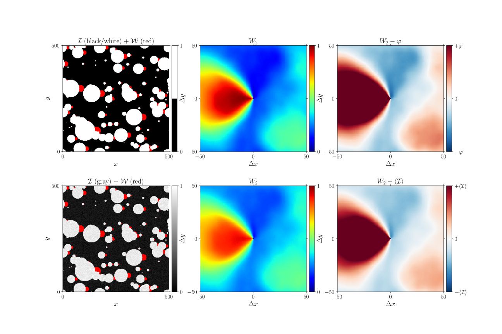
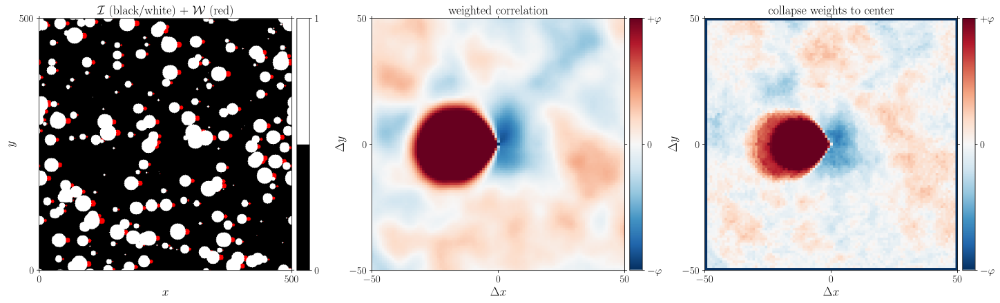

.. _theory_W2:

Weighted correlation
====================

Theory
------

The weighted correlation characterises the average indicator :math:`\mathcal{I}`
around high weight factor :math:`\mathcal{W}`.

Mathematically the weighted correlation reads

.. math::

    \mathcal{P} (\Delta \vec{x}) = \frac{
        \sum_i
        \mathcal{W}(\vec{x}_i) \;
        \mathcal{I}(\vec{x}_i + \Delta x)
    }{
        \sum_i
        \mathcal{W}(\vec{x}_i) \;
    }

Additionally pixels can be masked, for instance to ignore :math:`\mathcal{I}`
everywhere where :math:`\mathcal{W}` is non-zero.
The masked correlation reads

.. math::

    \mathcal{P} (\Delta \vec{x}) =
    \frac{
        \sum_{i}\;
        \mathcal{W} (\vec{x}_i) \;
        [ \mathcal{I} (1-\mathcal{M}) ] (\vec{x}_i + \Delta \vec{x}) \;
    }{
        \sum_{i}\;
        \mathcal{W} (\vec{x}_i) \;
        (1-\mathcal{M})\, (\vec{x}_i + \Delta \vec{x}) \;
    }

where all pixels where :math:`\mathcal{M}(\vec{x}_i) = 1` are ignored;
all pixels for which :math:`\mathcal{M}(\vec{x}_i) = 0` are considered as normal.

.. seealso::

    * T.W.J. de Geus, R.H.J. Peerlings, M.G.D. Geers (2015).
    *Microstructural topology effects on the onset of ductile failure in multi-phase materials –
    A systematic computational approach.*
    International Journal of Solids and Structures, 67–68, 326–339.
    doi: `10.1016/j.ijsolstr.2015.04.035 <https://doi.org/10.1016/j.ijsolstr.2015.04.035>`_,
    arXiv: `1604.02858 <http://arxiv.org/abs/1604.02858>`_
    * T.W.J. de Geus, C. Du, J.P.M. Hoefnagels, R.H.J. Peerlings, M.G.D. Geers (2016).
    Systematic and objective identification of the microstructure around
    damage directly from images.*
    Scripta Materialia, 113, 101–105.
    doi: `10.1016/j.scriptamat.2015.10.007 <https://doi.org/10.1016/j.scriptamat.2015.10.007>`_,
    arXiv: `1604.03814 <http://arxiv.org/abs/1604.03814>`_

.. note::

    The notation is short-hand for:

    .. math::

        \mathcal{P} (\Delta \vec{x}) =
        \frac{
            \sum_{i}\;
            \left[ \mathcal{W} (\vec{x}_i) \right] \;
            \left[
                \mathcal{I}(\vec{x}_i + \Delta \vec{x})
                (1-\mathcal{M})(\vec{x}_i + \Delta \vec{x})
            \right]
        }{
            \sum_{i}\;
            \left[ \mathcal{W} (\vec{x}_i) \right] \;
            \left[ 1-\mathcal{M}(\vec{x}_i + \Delta \vec{x}) \right]
        }

Example
-------

| :download:`W2.py <examples/W2.py>`
| :download:`W2.cpp <examples/W2.cpp>`

.. note::

    Like for the :ref:`2-point correlation <theory_S2>`,
    a :ref:`mask <theory_S2_masked>` can be used.
    Similarly, the average can be extended to that of an
    :ref:`ensemble <theory_S2_ensemble>` of images.

Python
^^^^^^

.. literalinclude:: examples/W2.py
    :language: python
    :start-after: <snippet>
    :end-before: </snippet>

C++
^^^

.. literalinclude:: examples/W2.cpp
    :language: cpp

Collapse to single point
------------------------

To calculate the probability of the inclusion directly next to a weight site
(i.e. the red circles in the example above and below) the 'collapsed correlation' is calculated.
The distance to the edge of the site, :math:`\vec{\delta}_i` is therefore corrected for as follows:

.. math::

    \mathcal{P} (\Delta \vec{x}) =
    \frac{
        \sum_{i}\;
        \mathcal{W} (\vec{x}_i) \;
        \mathcal{I} (\vec{x}_i + \Delta \vec{x} + \vec{\delta}_i) \;
    }{
        \sum_{i}\;
        \mathcal{W} (\vec{x}_i) \;
    }

Similarly to the above, a mask may be introduced as follows:

.. math::

    \mathcal{P} (\Delta \vec{x}) =
    \frac{
        \sum_{i}\;
        \mathcal{W} (\vec{x}_i) \;
        [ \mathcal{I} (1-\mathcal{M}) ] (\vec{x}_i + \Delta \vec{x} + \vec{\delta}_i) \;
    }{
        \sum_{i}\;
        \mathcal{W} (\vec{x}_i) \;
        (1-\mathcal{M})\, (\vec{x}_i + \Delta \vec{x} + \vec{\delta}_i) \;
    }

.. seealso::

    * T.W.J. de Geus, C. Du, J.P.M. Hoefnagels, R.H.J. Peerlings, M.G.D. Geers (2016).
    Systematic and objective identification of the microstructure around
    damage directly from images.*
    Scripta Materialia, 113, 101–105.
    doi: `10.1016/j.scriptamat.2015.10.007 <https://doi.org/10.1016/j.scriptamat.2015.10.007>`_,
    arXiv: `1604.03814 <http://arxiv.org/abs/1604.03814>`_

Example
^^^^^^^

| :download:`W2c.py <examples/W2c.py>`
| :download:`W2c.cpp <examples/W2c.cpp>`

.. note::

    Like for the :ref:`2-point correlation <theory_S2>`,
    a :ref:`mask <theory_S2_masked>` can be used.
    Similarly, the average can be extended to that of an :ref:`ensemble <theory_S2_ensemble>`
    of images.

Python
^^^^^^

.. literalinclude:: examples/W2c.py
    :language: python
    :start-after: <snippet>
    :end-before: </snippet>

C++
^^^

.. literalinclude:: examples/W2c.cpp
    :language: cpp
