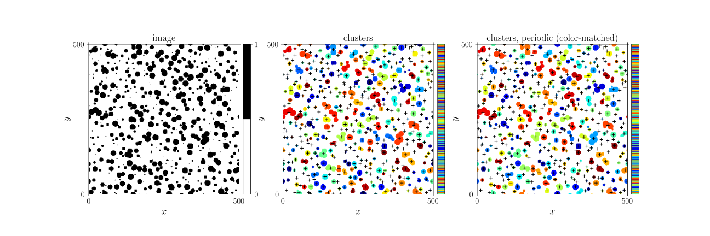

.. _theory_clusters:

Obtain clusters
===============

Calculate clusters
------------------

Extract clusters ('islands' of connected pixels with the same value).

| :download:`clusters.py <examples/clusters.py>`
| :download:`clusters.cpp <examples/clusters.cpp>`

.. image:: examples/clusters.svg
  :width: 700px

Python
^^^^^^

.. literalinclude:: examples/clusters.py
   :language: python
   :start-after: <snippet>
   :end-before: </snippet>

C++
^^^

.. literalinclude:: examples/clusters.cpp
   :language: cpp

Calculate clusters and centers
------------------------------

| :download:`clusters_centers.py <examples/clusters_centers.py>`
| :download:`clusters_centers.cpp <examples/clusters_centers.cpp>`

Python
^^^^^^

.. literalinclude:: examples/clusters_centers.py
   :language: python
   :start-after: <snippet>
   :end-before: </snippet>

C++
^^^

.. literalinclude:: examples/clusters_centers.cpp
   :language: cpp

Dilate clusters (differently)
-----------------------------

| :download:`clusters_dilate.py <examples/clusters_dilate.py>`
| :download:`clusters_dilate.cpp <examples/clusters_dilate.cpp>`

.. image:: examples/clusters_dilate.svg
  :width: 700px

Python
^^^^^^

:download:`clusters_dilate.py <examples/clusters_dilate.py>`

.. literalinclude:: examples/clusters_dilate.py
   :language: python
   :start-after: <snippet>
   :end-before: </snippet>

C++
^^^

.. literalinclude:: examples/clusters_dilate.cpp
   :language: cpp
