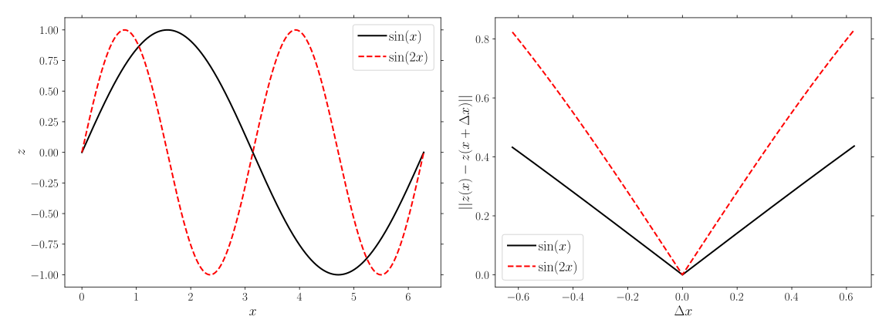

.. _theory_heightheight:

Height-height correlation
=========================

The height-height correlation corresponds to the following:

.. math::

  \mathcal{P} (\Delta \vec{x}) =
  \sqrt{ \sum_{i} \; \left(
    z (\vec{x}_i + \Delta \vec{x}) -
    z (\vec{x}_i)
  \right)^2 }

Example
-------

| :download:`heightheight.py <examples/heightheight.py>`
| :download:`heightheight.cpp <examples/heightheight.cpp>`

.. note::

  Like for the :ref:`2-point correlation <theory_S2>`, a :ref:`mask <theory_S2_masked>` can be used. Similarly, the average can be extended to that of an :ref:`ensemble <theory_S2_ensemble>` of images.

Python
^^^^^^

.. literalinclude:: examples/heightheight.py
   :language: python
   :start-after: <snippet>
   :end-before: </snippet>

C++
^^^

.. literalinclude:: examples/heightheight.cpp
   :language: cpp
