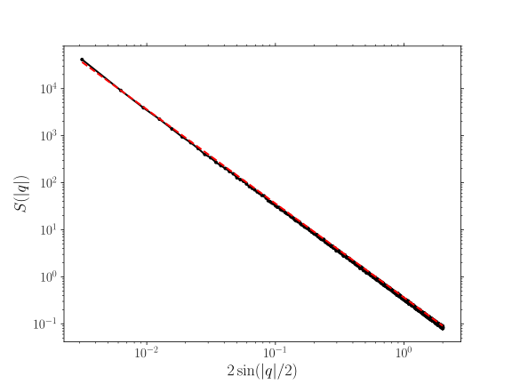

.. _theory_heightheight:

******************
Height correlation
******************

Structure factor
================

The structure factor is defined as:

.. math::

    S(\vec{q}) = \langle \hat{u}(\vec{q}) \hat{u}(\vec{q}) \rangle

where :math:`\vec{q}` is the angular frequency.

Height-height correlation
=========================

The height-height correlation corresponds to the following:

.. math::

    \mathcal{P} (\Delta \vec{x}) =
    \sqrt{ \sum_{i} \; \left(
        z (\vec{x}_i + \Delta \vec{x}) -
        z (\vec{x}_i)
    \right)^2 }

Example
-------

.. image:: examples/heightheight.svg
    :width: 700px

.. note::

    Like for the :ref:`2-point correlation <theory_S2>`, a :ref:`mask <theory_S2_masked>` can be used. Similarly, the average can be extended to that of an :ref:`ensemble <theory_S2_ensemble>` of images.

.. tabs::

    .. tab:: Python

        :download:`heightheight.py <examples/heightheight.py>`

        .. literalinclude:: examples/heightheight.py
            :language: python
            :start-after: <snippet>
            :end-before: </snippet>

    .. tab:: C++

        :download:`heightheight.cpp <examples/heightheight.cpp>`

        .. literalinclude:: examples/heightheight.cpp
            :language: cpp
